<p align="center">
  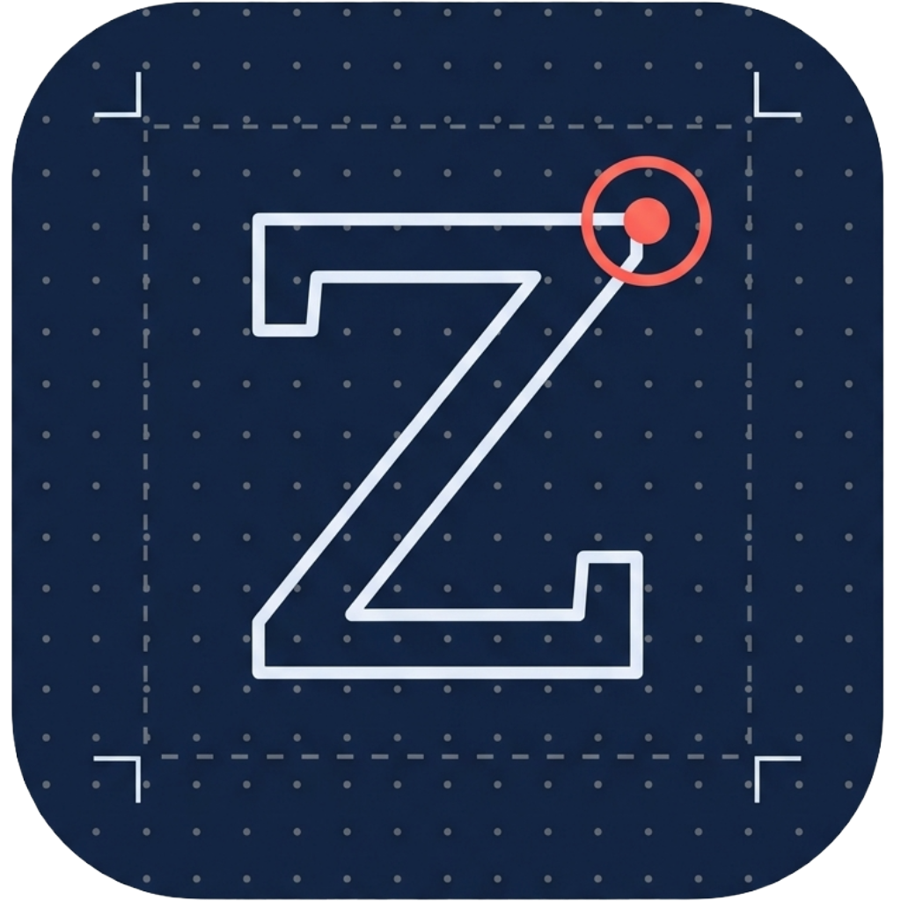
</p>

<h1 align="center">ZLynstall</h1>

<p align="center">
  <b>Drop a <code>.deb</code>, an <code>.rpm</code> or an AppImage. It just installs.</b><br>
  On any distro. With a menu entry. And a way to remove it again.
</p>

<p align="center">
  <a href="LICENSE"></a>
  
  
  
</p>

<p align="center">
  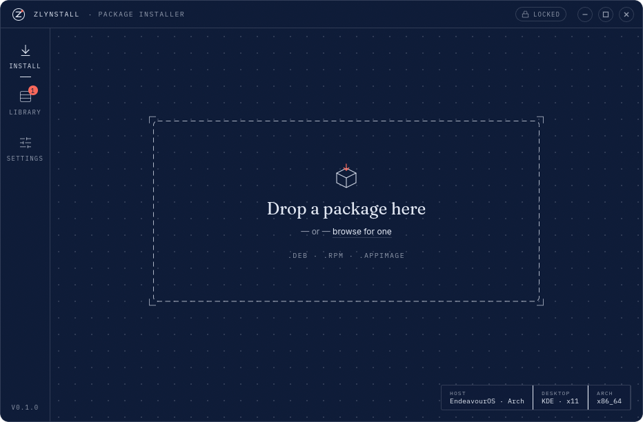
</p>

---

## What is this?

You found an app you want. The download page hands you a `.deb`, an `.rpm` or an `.AppImage` — and your distro only speaks one of those. On Arch a `.deb` means an afternoon with `debtap`. On Fedora a `.deb` means "no". AppImages work everywhere but sit in `~/Downloads` forever, invisible to your app menu.

**ZLynstall is one drop zone that does the right thing:**

| You drop… | on Arch / EndeavourOS / Manjaro | on Debian / Ubuntu / Mint | on Fedora / RHEL | on openSUSE |
|---|---|---|---|---|
| **`.deb`** | rebuilt as a real `pacman` package and installed | installed with `apt` | rebuilt as an RPM and installed with `dnf` | rebuilt as an RPM and installed with `zypper` |
| **`.rpm`** | rebuilt as a real `pacman` package and installed | rebuilt as a `.deb` and installed with `apt` | installed with `dnf` | installed with `zypper` |
| **`.AppImage`** | moved to `~/Applications`, added to your app menu | same | same | same |

"Rebuilt" means a **proper native package**: your package manager tracks the files, dependencies get translated to what they're called on *your* distro, and uninstalling is a normal uninstall. No files sprayed into `/opt` that nobody remembers.

Everything ZLynstall installs lands in its **Library**, where you can open it, remove it, repair its shortcuts, give it a desktop icon, or update it by dropping a newer file.

---

## Features

### Drop it. Read it. Install it.

<p align="center">
  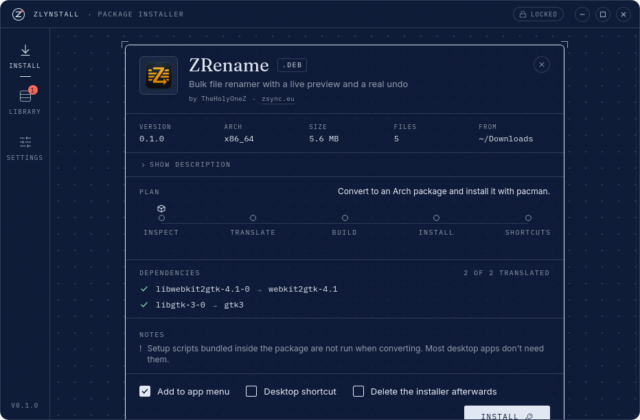
</p>

Drop a file (or click *browse*, or right-click it in your file manager → *Open with → ZLynstall*) and you get a **spec sheet** before anything happens:

- **What it is** — name, version, architecture, size, who made it, their website, licence, and the full description on demand. ZLynstall reads all of this **without running the file**.
- **The plan** — in one sentence, what will happen on *your* machine ("Convert to an Arch package and install it with pacman").
- **Dependencies, translated** — `libgtk-3-0` becomes `gtk3` on Arch, `libwebkit2gtk-4.1-0` becomes `webkit2gtk-4.1`. Anything that can't be translated is shown with a dashed underline and a plain explanation — never hidden, never a silent failure. The install goes ahead without it, because most desktop apps bundle what they need.
- **Notes** you should know about (setup scripts inside the package aren't run when converting; the package was built for another CPU; you already have this version installed…).
- **Three switches**: add to app menu · desktop shortcut · delete the installer afterwards.

Then press **Install** (or just hit <kbd>Enter</kbd>).

### Watch it happen

<p align="center">
  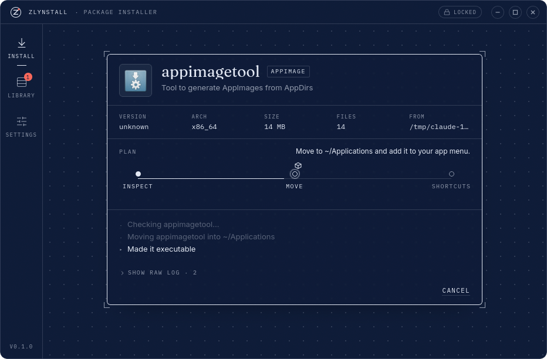
  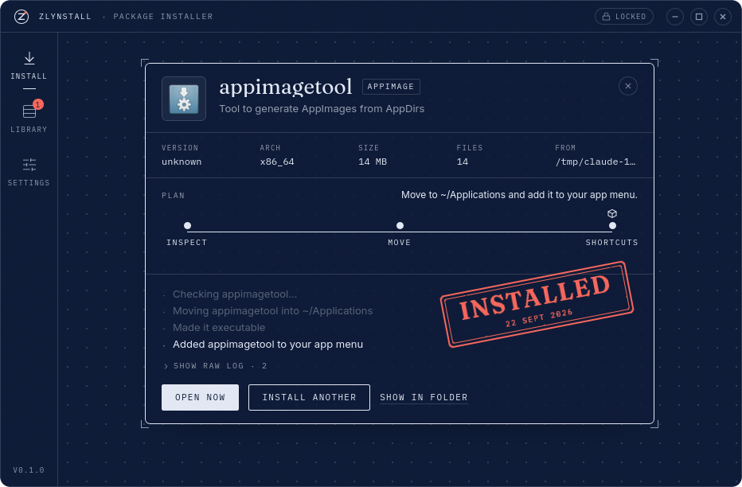
</p>

Every install is drawn as a **stage track** — *Inspect → Translate → Build → Install → Shortcuts* — with a little package travelling from node to node, and a **plain-language narration** underneath ("Translated 2 of 2 dependencies to Arch package names", "Building an Arch package (this is the slow bit)", "Made a menu entry for Hello"). The raw command log is one click away if you're curious.

When it's done, the sheet gets **stamped**. Soft sounds mark the drop, each finished stage, and the stamp (all optional). Something went wrong? You get a **VOID** stamp, the real reason, and a hint about what to do. Cancel any time — the running command is stopped and nothing half-done is left behind.

### AppImages, done properly

<p align="center">
  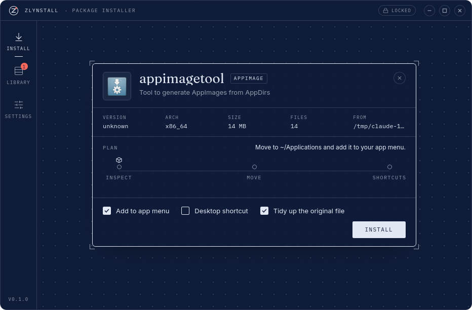
</p>

An AppImage is read straight from its embedded filesystem (again, without executing it): its name, version, icon and menu entry come out, and then it's

1. moved out of `~/Downloads` into `~/Applications` (configurable) and made executable,
2. given a proper **app-menu entry** with its real icon,
3. optionally a **desktop shortcut**,
4. and registered in the Library so it can be removed cleanly later.

No `libfuse2`? ZLynstall notices and makes the launcher use the AppImage's extract-and-run mode instead, so it still starts.

### The Library

<p align="center">
  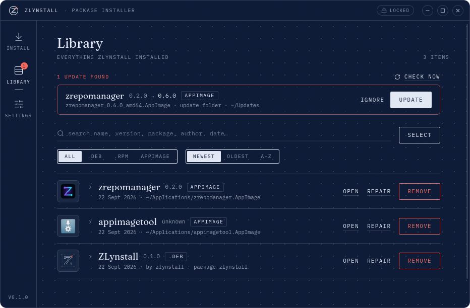
</p>

Everything ZLynstall ever installed, in one ledger — `.deb`, `.rpm` and AppImage alike:

- **Open**, **Repair shortcuts**, **Remove** on every row. Removing a package uses your package manager; removing an AppImage deletes the file, its icon and its menu entry.
- **Search** by name, version, package name, author, file path or install date. **Filter** by kind. **Sort** newest / oldest / A–Z.
- Click a row for **details**: description, author, website, licence, architecture, download size, where the file came from, dependencies that couldn't be translated, and the app's **version history**.

<p align="center">
  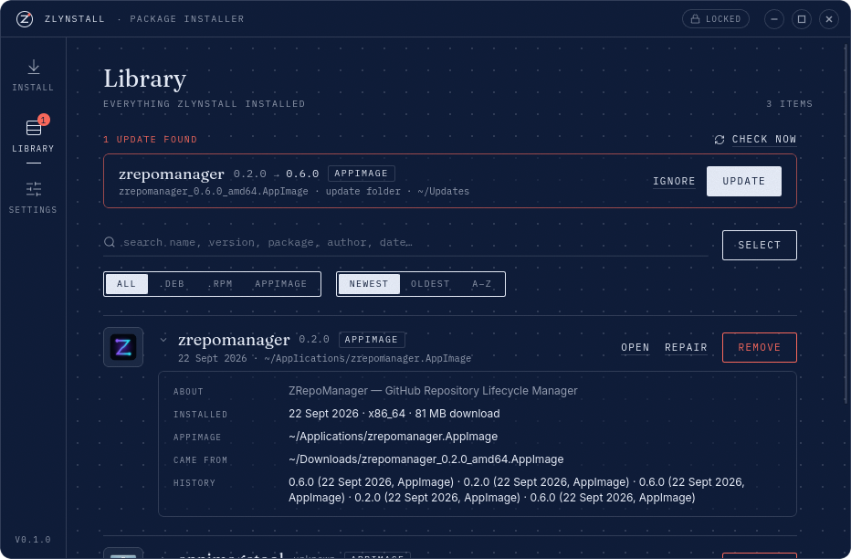
  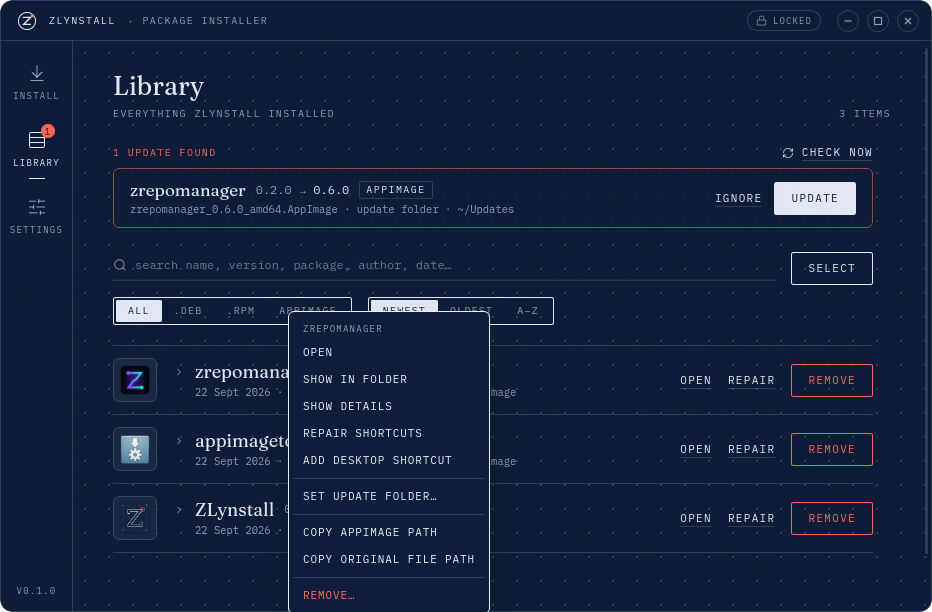
</p>

- A **right-click menu** with everything: open, show in folder, open website, show details, repair shortcuts, add/remove desktop shortcut, set an update folder, copy paths, remove.
- **Select** mode for **bulk actions** — repair or remove many apps at once. Removing several packages is one transaction, so it's one password, not one per app.

<p align="center">
  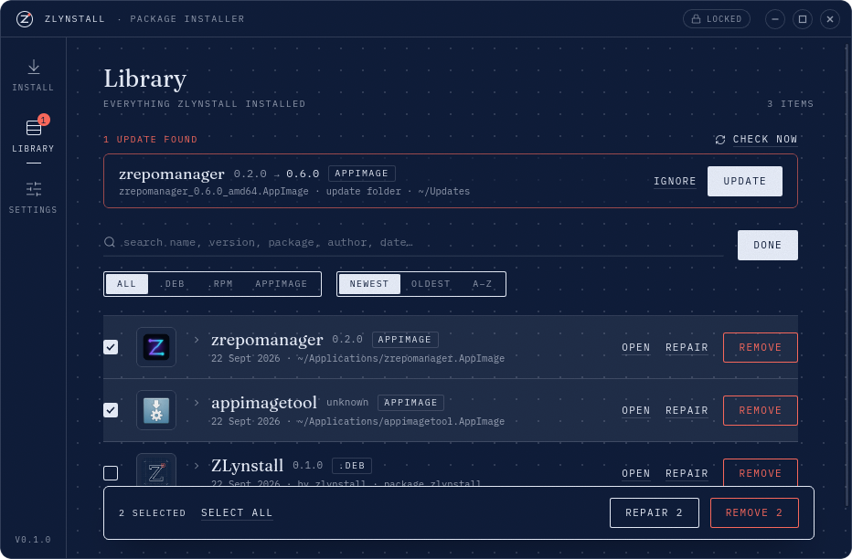
</p>

### Updates, without an updater

Most small apps have no auto-updater — you download a new file and wonder what to do with it. ZLynstall turns that file into an update, three ways:

| How | What happens |
|---|---|
| **Drop a newer file** on ZLynstall | It recognises the app it belongs to (same package, same name, or a matching file name like `imagetoolv1.2.0.AppImage`), shows **"Update · 0.6.0 → 0.7.0"** on the sheet, and the button says *Update*. Same version? It says *Reinstall*. Older? *Downgrade* — clearly marked. |
| **A global update folder** (Settings → Updates) | Point it at a folder. On every start (and on *Check now*) ZLynstall looks inside, and offers any file that **clearly belongs to an installed app and is newer**. Nothing is guessed loosely: strangers in that folder are ignored. |
| **A per-app update folder** (right-click → *Set update folder…*) | For that one app, **any** package file in its folder with a newer version is offered — the file name doesn't matter at all. Perfect for apps you build yourself. |

Found updates appear at the top of the Library with **Update / Ignore / Update all**, and as a red badge on the Library tab. Turn on *Install updates automatically* and they run by themselves when ZLynstall starts. Every update keeps the app's Library entry and adds the old version to its history.

### Shortcuts you can trust

- Packages that ship their own menu entry are left alone; ZLynstall only *adds* what's missing. Packages **without** one get a generated entry pointing at the right program (command-line tools get a terminal entry instead of a dead icon).
- **Desktop shortcut** on install, or later from the right-click menu — and off again just as easily.
- **Repair shortcuts** re-creates anything that went missing, for AppImages and packages alike.

### One password, once

<p align="center">
  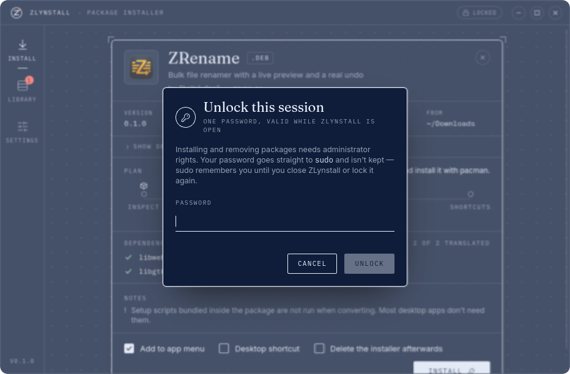
</p>

Installing and removing packages needs administrator rights. Instead of a system password prompt for every single action, ZLynstall asks **once per session** in its own dialog. Your password goes straight to `sudo` and is never stored — sudo's own credential cache remembers you while the app is open, and it's forgotten the moment you close ZLynstall (or click the **UNLOCKED** pill in the title bar to lock it again).

Prefer the classic way? *Settings → Password → Every time* switches to your desktop's normal prompt. If sudo isn't set up for your user, that's what you get automatically. ZLynstall itself **never runs as root**: only the single package-manager command does.

### Settings

<p align="center">
  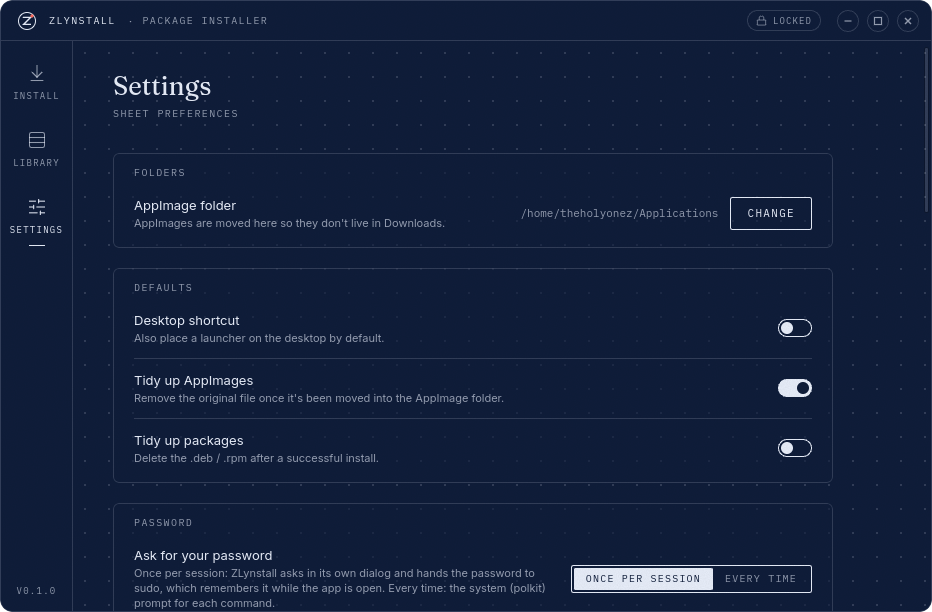
</p>

Where AppImages go · default switches · password mode · update folder and auto-updates · theme and window frame · sounds · and a **Tools** list showing which helpers your system has (`makepkg`, `rpmbuild`, `libfuse2`…) with a one-click install for anything missing.

### Two looks

<p align="center">
  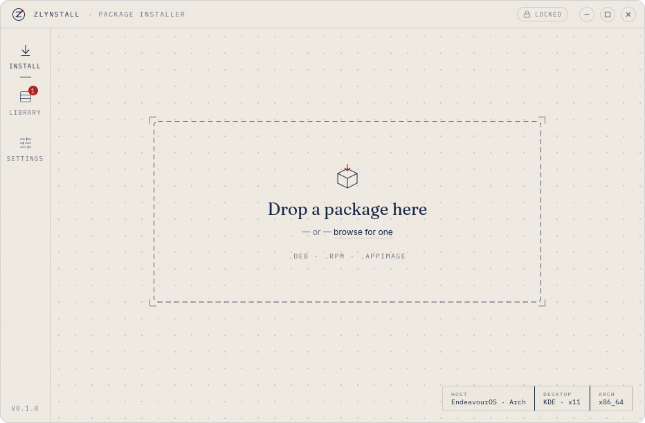
  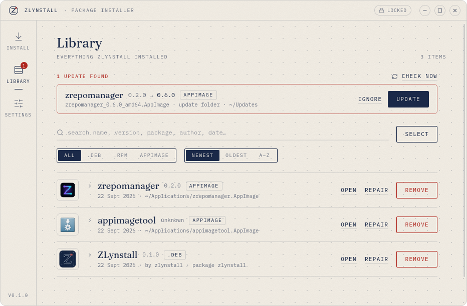
</p>

**Paper** (ink on cream) or **Blueprint** (white lines on navy) — or follow your system. Frameless window with its own title bar by default; switch to your desktop's window frame in Settings if you prefer.

### The small things

- **"Open with"** from your file manager — ZLynstall registers itself for `.deb`, `.rpm` and AppImage files. Drop several files at once; they queue up.
- <kbd>Enter</kbd> installs, <kbd>Esc</kbd> dismisses. Cancel stops the running command.
- Respects your *reduced motion* preference.
- No network access, ever. No telemetry. Fonts are bundled. What you drop is what it reads.

---

## Install ZLynstall

Grab the package for your distro from **[zsync.eu/zlynstall](https://zsync.eu/zlynstall/)** or the **[Releases](https://github.com/TheHolyOneZ/ZLynstall/releases)** page:

| Distro | File | Then |
|---|---|---|
| Debian / Ubuntu / Mint | `zlynstall_x.y.z_amd64.deb` | `sudo apt install ./zlynstall_*.deb` |
| Fedora / RHEL / openSUSE | `zlynstall-x.y.z-1.x86_64.rpm` | `sudo dnf install ./zlynstall-*.rpm` (or `zypper`) |
| Arch / EndeavourOS / Manjaro | `zlynstall_x.y.z_amd64.AppImage` + the `.deb` | Run the AppImage once, drop the `.deb` on it — ZLynstall installs *itself* as a proper pacman package. (An AUR package is on the way; `packaging/aur/PKGBUILD` is in the repo.) |
| Anything else | `zlynstall_x.y.z_amd64.AppImage` | `chmod +x` and run |

<details>
<summary><b>What your distro needs to have</b></summary>

ZLynstall shells out to your distro's own tools — nothing exotic:

| | needed for | package |
|---|---|---|
| `pkexec` **or** `sudo` | asking for your password | `polkit` / `sudo` (already there on every desktop) |
| `makepkg` + `fakeroot` | converting on Arch | `base-devel` |
| `dpkg-deb` | converting on Debian/Ubuntu | `dpkg` (always installed) |
| `rpmbuild` | converting on Fedora/openSUSE | `rpm-build` |
| `libfuse.so.2` | running AppImages normally | `fuse2` / `libfuse2t64` / `fuse-libs` / `libfuse2` (optional — see above) |

*Settings → Tools* shows what's present and installs what's missing.
</details>

<details>
<summary><b>Build it yourself</b></summary>

```bash
git clone https://github.com/TheHolyOneZ/ZLynstall
cd ZLynstall
pnpm install
pnpm bundle        # → target/release/bundle/{deb,rpm,appimage}/
# or, to just run it:
pnpm tauri dev
```

Needs Node ≥ 20, pnpm, a Rust toolchain, and Tauri's Linux prerequisites (`webkit2gtk-4.1`, `gtk3`, `libappindicator`, `librsvg`). On Arch, `pnpm bundle` sets `NO_STRIP=true` for you because linuxdeploy's bundled `strip` chokes on newer binaries. There's also a `packaging/aur/PKGBUILD`.
</details>

---

## How it works (the honest version)

- **Reading a file never runs it.** `.deb` (an `ar` archive), `.rpm` (headers + cpio payload) and AppImages (an ELF with a squashfs image appended) are parsed in pure Rust.
- **Converting makes a real package.** On Arch a `PKGBUILD` is generated and built with `makepkg`, exactly as you would by hand; on Debian a `.deb` is assembled with `dpkg-deb`; on Fedora/openSUSE a `.spec` is written and built with `rpmbuild`. Then the *normal* package manager installs the result. Setup scripts embedded in the foreign package are not executed.
- **Dependencies** are translated through a curated table (GTK, WebKit, NSS, ALSA, X11, Wayland, libnotify, libsecret, indicators, OpenSSL, zlib… ~80 entries) plus careful guessing that is checked against your repositories. On RPM systems ZLynstall prefers library-level requirements (`libgtk-3.so.0()(64bit)`), which dnf and zypper resolve regardless of package naming.
- **Root is a single command.** ZLynstall itself never runs privileged; the one `pacman`/`apt-get`/`dnf`/`zypper` call does, through your unlocked sudo session or polkit.
- **It only deletes what it created.** Files in your Library are recorded; the original installer is deleted only if you asked for that *and* the install succeeded.
- **The same engine is verified on four distros** in containers before a release (Debian, Ubuntu, Fedora, openSUSE), and on Arch on real hardware.

---

## FAQ

<details>
<summary><b>The install failed with "couldn't translate" dependencies. Is my app broken?</b></summary>

Usually not. Most desktop apps (everything built on Electron or Tauri, for instance) bundle their libraries and only *declare* a handful of system ones. ZLynstall installs without the untranslatable ones and tells you which they were. If the app then refuses to start, the raw log and the dependency name will tell you what to install by hand.
</details>

<details>
<summary><b>Why does the sheet say "Setup scripts bundled inside the package are not run when converting"?</b></summary>

Debian and RPM packages can carry scripts that run during installation — usually to register a repository or a URL handler. When converting between formats those scripts are written for a different distro, so ZLynstall skips them rather than run something that may not fit your system. Desktop apps almost never need them.
</details>

<details>
<summary><b>Double-clicking a .deb still opens my archive manager.</b></summary>

Your desktop had a default for `.deb` before ZLynstall arrived. Either use right-click → *Open with → ZLynstall*, or make it the default:

```bash
xdg-mime default zlynstall.desktop application/vnd.debian.binary-package application/x-rpm application/vnd.appimage
```
</details>

<details>
<summary><b>My AppImage starts slowly / the sheet mentions "extract-and-run mode".</b></summary>

Modern AppImages need `libfuse2` to mount themselves. Without it ZLynstall makes the launcher unpack the AppImage on each start instead — it works, just slower. Install the package named under *Settings → Tools* and repair the shortcut.
</details>

<details>
<summary><b>Can I keep the file I dropped?</b></summary>

Yes. "Delete the installer afterwards" is off by default for packages. For AppImages "Tidy up the original file" is on by default because the file itself *becomes* the installed app (it's moved to `~/Applications`); turn it off to copy instead.
</details>

<details>
<summary><b>What does the global update folder pick up, exactly?</b></summary>

Only files that (a) are a valid `.deb`/`.rpm`/AppImage, (b) clearly belong to an app in your Library — same package name, same app name, or a file name that reduces to the app's name once the version is stripped — and (c) are newer than what's installed. Versions you've clicked *Ignore* on stay ignored. A per-app folder is looser on purpose: anything newer in there is offered.
</details>

<details>
<summary><b>Is there a command line?</b></summary>

Yes — the same engine, headless:

```bash
zlynstall-cli inspect  file.deb        # what's inside
zlynstall-cli plan     file.rpm        # what would happen on this machine
zlynstall-cli install  file.AppImage   # do it (--keep, --desktop, --no-menu)
zlynstall-cli list                     # the Library
zlynstall-cli uninstall <name-or-id>
zlynstall-cli repair    <name-or-id>
```

Add `--json` for machine-readable output. It runs as root inside containers without any prompts, which is how the distro tests work.
</details>

---

## Links

- **Website & downloads** — [zsync.eu/zlynstall](https://zsync.eu/zlynstall/)
- **Source code** — [github.com/TheHolyOneZ/ZLynstall](https://github.com/TheHolyOneZ/ZLynstall)
- **The developer** — [github.com/TheHolyOneZ](https://github.com/TheHolyOneZ)
- **More projects like this** — [zsync.eu](https://zsync.eu/)
- **Game mods** — [zlogic.eu](https://zlogic.eu/)

## For developers

The code is a Rust core (`crates/core`: inspection, conversion, backends, updater), a Tauri 2 shell (`src-tauri`) and a React 19 / TypeScript / Tailwind 4 frontend (`src`). Start with [`DEVELOPMENT.md`](DEVELOPMENT.md) for the commands and rules, and [`docs/ARCHITECTURE.md`](docs/ARCHITECTURE.md) for the design (the strategy matrix, the job/event model, the registry, the updater, the privilege model, the Blueprint design tokens).

---

## License

ZLynstall is free software: you can redistribute it and/or modify it under the terms of the **GNU General Public License, version 3 or later**. See [LICENSE](LICENSE).

Copyright © 2026 **TheHolyOneZ**
